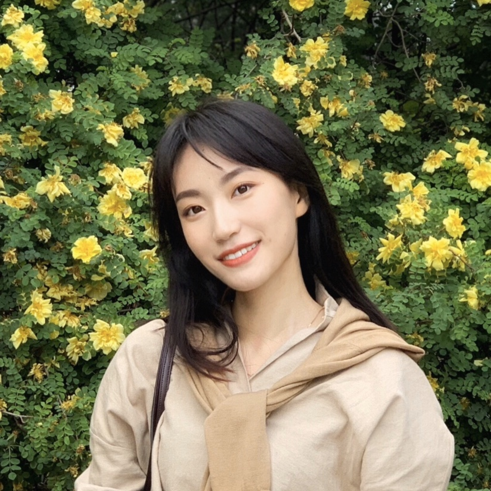

<h1>

<b>PAN Xinyu</b>

</h1>

Graduate Student of Social Psychology, Peking University

Email: panxinyu@pku.edu.cn 

Address: Room 1222, Wangkezhen Building, Peking University, Beijing, 100871 CHINA

 

 

## **EDUCATION BACKGROUND**

---

M.S. in <b>Social and Cultural Psychology</b>, PEKING UNIVERSITY

From September 2018

 

B.A. in <b>Philosophy</b>, SHANGHAI UNIVERSITY

September 2014 - July2018

 

B.A. in <b>Psychology</b> (Minor Degree), EAST CHANA NORMAL UNIVERSITY

September 2016 - July2018

 

 

## **PUBLICATIONS**

---

### **Journal Articles & Selected Manuscripts under Review**
- Hou, Y., **Pan, X.**, Cao, X., & Wang, Q. Going Public: The Mnemonic Effect of Retrieving Autobiographical Memories in Social Media. *Memory* (Revised & Resubmitted, 2nd round)
- **Pan, X.**, Zhang, J., Zhang, R & Li, R. Analysis of the Factors Affecting Weibo Internet Celebrities Population Segmentation and Fans Based on Data Mining, *Journal of Data Analysis* (Submitted for Initial Review)

### **Working Papers and Work in Progress**
- Jiang, T., Sedikides, C., **Pan, X.**, Wang, F., Li, H., Awe Awakens the Authentic Self.
- Jiang, T., **Pan, X.**, Wang, F., Awe relieves physical pain.
- Wang, X., Jiang, T., **Pan, X.**, Awe and high sensory products consumption
- **Pan, X.**, Jiang, T., The soothing effect of awe.
- **Pan, X.**, Yin, Y., Jiang, T., Sedikides, C., Nostalgia fosters ritual, the mediating effect of sense of meaning.
- **Pan, X.**, Yin, Y., Wang, Z., Jiang, T., Sedikides, C., Nostalgia improves parents’ tradition transfer intention, the moderating effect of self-child overlap.
- **Pan, X.**, Jiang, T., Sedikides, C., Nostalgia relieve physical pain.
- Hou, Y., **Pan, X.**, Zhang, M., Autobiographical memory clues to social orientation in Chinese self-development
- **Pan, X.**, Hou, Y., Ye, B., Effects of depressive symptoms and emotion on autobiographical memory and its mechanism
- LI, X., Sun, Y., Deng, Y., Yan, C., Huang, J., **Pan, X.**, Wang, R., Cohen, G., Large-scale data reveal WEIRDness trajectory in psychological research history

 

## **ACADEMIC EXPERIENCE**

---

<h3>

<b>Research Assistant</b>

2020.03-present

 </h3>

Supervisor:  JIANG Tonglin, School of Psychological and Cognitive Sciences, Peking University, Beijing

#### **Project: The soothing effect of awe**

- **Project Goal**: An empirical study of the soothing effect of awe on both positive and negative emotion.
- **Hypothesis**: Awe decreases the intensity of both positive and negative emotion via self-distancing.
- **Preliminary Results**: Awe reduced both positive and negative emotion arousal and was positively correlated with resilience, with the same findings in the field study in Tibet.
- **Duties included**: Proposing the idea, leading the project, experimental design, data analysis and manuscripts writing.

#### **Project: Awe awakens the authentic self**

- **Project Goal**: Based on small-self theory of awe, authentic-self theory is proposed to further explain the transformative nature of awe.
- **Hypothesis**: Awe activates authentic self via self-transcendence, which motivates pro-sociality out of intrinsic (vs. extrinsic) focus. 
- **Preliminary Results**: Awe enhances the sense of authentic self, via the mediating effect of self-transcendence, and promotes prosociality only when the helping behavior consistent with intrinsic authentic self (vs. inconsistent with intrinsic need).
- **Duties included**: Leading the project, experimental design, data analysis and manuscripts writing. 

#### **Project: Nostalgia improves parents’ tradition transfer intention**

- **Project Goal**: Exploring the impact of nostalgia on tradition transfer.
- **Hypothesis**: Nostalgia increased tradition transfer tendency, with self-child overlap playing a moderating role. 
- **Preliminary Results**: Nostalgia increased tradition transfer tendency when self-child overlap was low, while reversed significant interaction effect was found in longitudinal study.
- **Duties included**: Leading the project, experimental design and manuscripts writing.

 

<h3>

<b>Research Assistant</b>

2018.09-present

 </h3>

Beijing Key Laboratory of Behavior and Mental Health, Peking University

Supervisor: WANG Qi, Department of Human Development, Cornell University, Ithaca, NY / HOU Yubo, School of Psychological and Cognitive Sciences, Peking University, Beijing

#### **Project: The effect of retrieval contexts and cues on autobiographical memory**
- **Project Goal**: Exploring the difference in accuracy between online and offline recall of autobiographical memories.
- **Hypothesis**: Memories retrieved online are more tied to the “reminders” and more “fixed” over time than offline.
- **Results**: Online group recalled more details than offline group, but with higher score on inconsistency and commission.
- **Duties included**: Leading the project, experimental design, data analysis and manuscripts writing.

 

<h3>

<b>Research Assistant</b>

2020.03-2020.04

 </h3>

Supervisor: Geoffrey L. Cohen, Department of Psychology, Stanford University
- Large-scale Data Reveal WEIRDnessTrajectory In Psychological Research History

    *Major responsibility: data coding*

 

<h3>

<b>Research Assistant</b>

2018.08-2018.10

 </h3>

Supervisor: WANG Qing, Department of Psychology, East China Normal University, Shanghai
- Research on the relationship between mindful agency and deep learning approach

    *Major responsibilities: Literatures review, research material organization, experiment implementation, data analysis and manuscript writing*

 

<h3>

<b>Research Assistant</b>

2015.12-2018.6

 </h3>

Supervisor: YANG Qingfeng, Department of Philosophy, Shanghai University, Shanghai
- Research of relationship between ethical issue of big data and social governance

    *Major responsibilities: Literature review*
- Research of the philosophical nature of episodic memory and metamemory

    *Major responsibilities: Literature review, proposed the idea and manuscript writing*
- Workshop of Scientific Research and Humanistic Interpretation on Memory from a Multidisciplinary perspective (International)

    *Major responsibilities: Meeting organization, agenda design and material organization*

 

## **CONFERENCE PRESENTATIONS**

---

**Pan, X.**, Zhang, J., Liu, Y., Lei, X., &, Xiao, N. (May 2020). Data Visualization Research of Five Senses on the Thousand-Faced Beijing City. *Forum for Applied Psychology and Cognitive Science*, Beijing, China.

**Pan, X.**, Hou, Y. (October 2019). The Relationship between Junzi-style Personality and Leadership Performance: A Moderated Mediation Model. *The 22nd National Academic Conference of Psychology*, Hangzhou, China

**Pan, X.**, Jiang, T. Awe Fosters a Balanced Mind, *2021 Society for Personality and Social Psychology Virtual Annual Convention (SPSP, 2021)*, (Accepted).

 

## **SELECTED GRANT**

---

### Grant in the Role of a Co-Investigator
National Ministry of Education Funding for Undergraduate Innovation Project, “Research on College Students' Technology View from The Perspective of Science and Technology Philosophy”. (10-2016 to 12-2017; PI: Qingfeng YANG).
- Duties included: Proposed the idea, experimental design, data collection, analysis and manuscripts writing work

 

## **SELECTED AWARDS & SCHOLARSHIPS**

---

Graduate School Special Scholarship of Peking University

2020.9

 

National Scholarships for Basic Disciplines for consecutive three years

2015-2017

 

Honor of Excellent Student Leader, Shanxi Province

2008

 

Merit student of Shanxi Province

2008

 

 

## **OTHER EXPERIENCES**

---

<h3>

<b>Teaching Assistant</b>

2018.09-2019.01

 </h3>

Professor HOU Yubo's Teaching Assistant in *Cultural Psychology* Class. 
- Prepared teaching materials, communicated with students.

<h3>

<b>Intern</b>

2019.05-2019.11

 </h3>

**Project of Developing a Leadership APP for Internet Managers** (Based on *Tencent*)
- Summarized the iceberg model of the leadership among Chinese Internet leaders based on semi-structured interviews with 10 CEOs of the Internet industry and developed psychological scales of leadership, personality and emotional intelligence.
- Constructed percentile norm based on 4000 samples from local Internet company
- Successful lauched the APP with more than 30,000 users by far

 

## **SKILLS & COURSEWORK**

---

**Statistical Skills**: extensive knowledge of SPSS, LISREL, Jamovi and R

**Curriculum Hightlights**: Social psychology, Psychological Statistics, Developmental Psychology, Basic Psychology, Personality Psychology, Educational Psychology, Experimental Psychology, Cognitive psychology, Data mining
